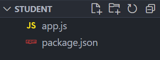
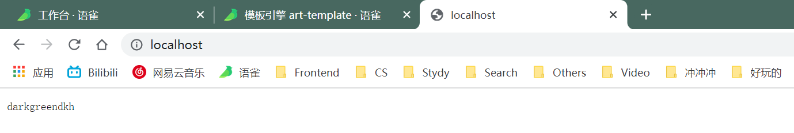
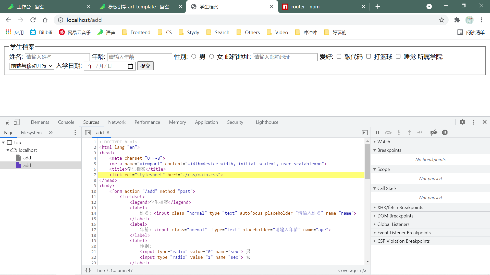
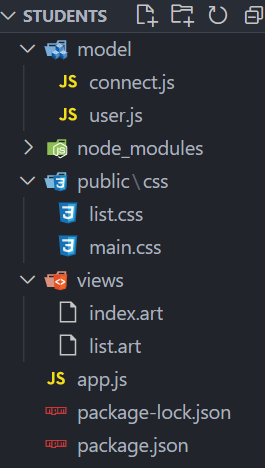
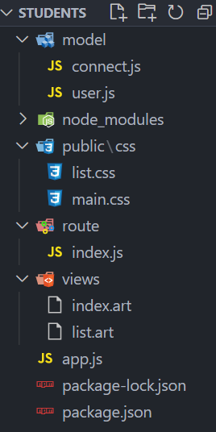

# 综合案例——学生档案管理

## 详细操作记录

一刷了解整个项目，并跟着做出来，二刷后整个项目自己去写一遍。

为此新建一个文件夹，做完后推送到 GitHub 上去。


### 1. 案例介绍——学生档案管理

目标：模板引擎应用，强化 Node.js 项目制作流程。

知识点：HTTP 请求响应、数据库、模板引擎、静态资源访问。


### 2. 制作流程

1. 建立项目文件夹并生成项目描述文件
2. 创建网站服务器实现客户端和服务器端通信
3. 连接数据库并根据需求设计学生信息表
4. 创建路由并实现页面模板呈递
5. 实现静态资源访问
6. 实现学生信息添加功能
7. 实现学生信息展示功能


#### 2.1 建立项目文件夹并生成项目描述文件

创建文件夹 `students`  

使用命令：`npm init -y`  生成  `package.json` 文件

创建 `app.js`

此时目录是这样的：



#### 2.2 创建网站服务器实现客户端和服务器端通信

这一点我很熟悉了，代码如下：

```JavaScript
const http = require('http');

const app = http.createServer();

app.on('request', (req, res) => {
    res.end('darkgreendkh');
});

app.listen(80);
console.log('网站服务器创建成功，请访问 localhost:3000');
```

之后使用命令：`nodemon app.js`

然后到浏览器中访问 `localhost:3000` 可以看到以下页面：



说明网站服务器已经创建好了，已经实现了客户端和服务器端的通信。

此时目录同上一步。


#### 2.3 连接数据库并根据需求设计学生信息表

连接数据库需要用到 `mongoose`  这个第三方模块

所以先使用命令：`npm install mongoose`  下载这个第三方模块

然后可以看到 `students` 文件夹里多出了 `node_modules` 文件夹 和 `package-lock.json` 文件

```JavaScript
const mongoose = require('mongoose')

mongoose.connect('mongodb://localhost/playground')
    .then(() => console.log('数据库连接成功'))
    .catch((err) => console.log(err, '数据库连接失败'));
```

上述是连接数据库的代码，我们单独将其放入一个新建文件夹 `model` 中的 `connect.js` 中。

此时目录是这样的：


然后将连接数据库的代码导入到 `app.js` 文件中，代码是 `require('./model/connect.js')`

之后在 `model` 文件夹中新建一个 `user.js` 文件，在这个文件下设定集合规则，并创建学生信息集合。

代码如下：

```JavaScript
const mongoose = require('mongoose');

const studentsSchema = new mongoose.Schema({
    name: {
        type: String,
        required: true,
        minlength: 2,
        maxlength: 10
    },
    age: {
        type: Number,
        min: 10,
        max: 25
    },
    sex: String,
    email: String,
    hobbies: [String],
    college: String,
    enterData: {
        type: Date,
        default: Date.now
    }
});

const Student = mongoose.model('Student', studentsSchema);

// 因为 app.js 文件里要用到这个 Student 集合，所以要把这个集合构造函数开放出去，通过 module.exports 进行开放
module.exports = Student;
```

 然后回到 `app.js` 文件当中，导入 `user.js` ，代码是：`const Student = require('./model/user.js')`

别忘了使用命令：`net start mongodb` 去启动数据库


#### 2.4 创建路由并实现页面模板呈递

##### 2.4.1 路由是什么

路由是指客户端请求地址与服务器端程序代码的对应关系。

简单来说，就是请求什么响应什么。

实现路由路由功能的步骤：

1. 获取客户端的**请求方式**（GET 或 POST）
2. 获取客户端的**请求地址**

##### 2.4.2 第三方模块：[router](https://www.npmjs.com/package/router)

先介绍一个第三方模块 `router`

功能：实现路由

使用步骤：

1. 获取路由对象
2. 调用路由对象提供的方法创建路由
3. 启用路由，使路由生效

示例代码如下：

```JavaScript
const getRouter = require('router');
const router = getRouter();
router.get('/add', (req, res) => {
    res.end('Hello World');
});
server.on('request', (req, res) => {
    router(req, res);
});
```

在 `app.js` 中添加以下代码：

```js
// 引入 router 模块
const getRouter = require('router');
// 获取路由对象
const router = getRouter();
// 创建路由
// 呈递学生档案信息添加页面
router.get('/add', (req, res) => {
    res.end('test');
});
// 呈现学生档案信息列表页面
router.get('/list', (req, res) => {
    res.end('index');
});

app.on('request', (req, res) => {
    // 启动路由
    router(req, res, () => { })
});
```

然后来实现模板呈递，就是当用户访问什么页面时就呈现什么页面

这里用到刚刚学习的模板引擎 `art-template`

去使用命令：`npm install art-template`  下载这个第三方模块	

再来新建一个文件夹：`views`  用来存放模板文件（也就是那两个 html 文件），而 css 文件属于静态资源，所以将其存放在另一个新建文件夹 `public` 下。


#### 2.5 实现静态资源访问

```JavaScript
// 引入 path 模块
const path = require('path');
// 配置模板所在目录
template.defaults.root = path.join(__dirname, 'views');

// 呈递学生档案信息添加页面
router.get('/add', (req, res) => {
    // template 方法返回的是一个拼接好的字符串
    const html = template('index.art', {});
    res.end(html);
});
```

然后我们到浏览器中去到 add 页面，发现一直在转圈，没有返回 `index.art` 对应的页面，然后打开开发者工具，查看源代码，可以看到，这个文件外链了一个 css 文件，而我们并没有响应给它这个 css 文件，所以才会一直查找这个文件，所以当我们暂停这个操作时，显示给我们的是一个 html 页面，并没有我们的 css 样式。



那么我们接下来的任务就是将这个外链 css 文件（也就是静态资源）响应给它。

##### 2.5.1 第三方模块 [server-static](https://www.npmjs.com/package/server-static)

我们选择利用第三方模块来实现这个静态资源访问的功能。

功能：实现静态资源访问功能

步骤：

1. 引入这个方法：`const serveStatic = require('serve-static');`
2. 调用这个方法，创建静态资源服务，并指定静态资源服务的目录
3. 启用静态资源访问服务功能

示例代码：

```js
const serveStatic = require('serve-static');
// 指定静态资源目录为 public, 返回值是一个方法, 我们用 serve 去接收
// 然后调用这个方法 serve 即可启用静态资源访问服务功能
const serve = serveStatic('public');
server.on('request', () => {
	serve(req, res);
});
server.listen(3000);
```

在项目中使用它：

别忘了先下载：`npm install serve-static`

```js
const serveStatic = require('serve-static');
// 刚刚没写参数(也就是静态资源的目录)，报错：TypeError: root path required
const serve = serveStatic(path.join(__dirname, 'public'));

app.on('request', (req, res) => {
    // res.end('darkgreendkh');
    // 启用路由功能
    router(req, res, () => { });
    // 启用静态资源访问功能
    serve(req, res, () => { });
});

// 呈递学生档案信息添加页面
router.get('/add', (req, res) => {
    // template 方法返回的是一个拼接好的字符串
    const html = template('index.art', {});
    res.end(html);
});
// 呈现学生档案信息列表页面
router.get('/list', (req, res) => {
    const html = template('list.art', {});
    res.end(html);
});

```

然后再去访问 add 那个页面，发现具有了 css 样式，说明静态资源访问服务功能已经实现了

然后同样的方法也呈递了 list 页面。

此时的目录结构是这样的：



到这里，基本的连接数据库，页面呈递，静态资源访问，路由功能都已经实现了。

接下来要去实现学生信息添加和展示功能了。

#### 2.6 学生信息添加和查询功能

步骤分析：

1. 在模板的表单中指定请求地址和请求方式。
2. 为每一个表单项添加 name 属性
3. 添加实现学生信息功能路由
4. 接收客户端传递过来的学生信息
5. 将学生信息添加到数据库中
6. 将页面重定向到学生信息列表页面

1 ：给 form 表单添加请求地址（action）和请求方式（method）

2： 添加 name 属性

代码如下：

```html
<form action="/add" method="post">
	<fieldset>
		<legend>学生档案</legend>
		<label>
			姓名: <input class="normal" type="text" autofocus placeholder="请输入姓名" name="name">
		</label>
		<label>
			年龄: <input class="normal"  type="text" placeholder="请输入年龄" name="age">
		</label>
		<label>
			性别: 
			<input type="radio" value="0" name="sex"> 男
			<input type="radio" value="1" name="sex"> 女
		</label>
		<label>
			邮箱地址: <input class="normal" type="text" placeholder="请输入邮箱地址" name="email">
		</label>
		<label>
			爱好: 
			<input type="checkbox" value="敲代码" name="hobbies"> 敲代码
			<input type="checkbox" value="打篮球" name="hobbies"> 打篮球
			<input type="checkbox" value="睡觉" name="hobbies"> 睡觉
		</label>
		<label>
			所属学院: 
			<select class="normal" name="college">
				<option value="前端与移动开发">前端与移动开发</option>
				<option value="PHP">PHP</option>
				<option value="JAVA">JAVA</option>
				<option value="Android">Android</option>
				<option value="IOS">IOS</option>
				<option value="UI设计">UI设计</option>
				<option value="C++">C++</option>
			</select>
		</label>
		<label>
			入学日期: <input type="date" class="normal" name="enterDate">
		</label>
		<label class="btn">
			<input type="submit" value="提交" class="normal">
		</label>
	</fieldset>
</form>
```

然后来实现当客户端提交数据时，服务器端怎么去获取客户端提交的数据，并将其添加到数据库中。

```js
// 引入 querystring 模块
const querystring = require('querystring');

// 实现学生信息添加功能路由
router.post('/add', (req, res) => {
    // 声明一个变量，来接收 post 请求参数
    let formData = '';
    req.on('data', param => {
        // 这里的 formDate 是一个字符串
        formData += param;
    });
    req.on('end', async () => {
        // querystring 是一种将字符串转为对象的方法
        // 因为要将这个 formData 提交到数据库中，所以需要转化为对象的形式
        await Student.create(querystring.parse(formData))
        // 重定向
        res.writeHead(301, {
            // 这句的意思是：添加到数据库后，跳转到 list 页面
            location: '/list'
        });
        res.end();
    });
});
```

接下来去实现当客户端提交的数据被服务端获取，并且已经添加到了数据库中后，怎么将数据库中的数据呈现在网页的客户端上。

步骤：

1. 从数据库中将所有的学生信息查询出来
2. 通过模板引擎将学生信息和 HTML 模板进行拼接
3. 将拼接好的 HTML 模板响应给客户端

```js
// 导出 dateformate 方法，给 list.art 文件使用
template.defaults.imports.dateformate = dateformate;

router.get('/list', async (req, res) => {
    // 查询所有学生信息（数据库的增删改查操作中的查）
    let students = await Student.find();
    // 这里的 students 是一个数组，数组中含有学生信息数据，数据以对象的形式存储
    console.log(students);
    const html = template('list.art', {
        students: students
    });
    res.end(html);
});
```

下面要用到第三方模块 dateformat ，所以先来下载：`npm install dateformate@2.0.0` 注意这里的下载版本，如果是最新的，就用不了，我目前也不懂，所以下载老版本先用着，以后学透彻了回来看。

然后引入 `app.js` ：`const dateformate = require('datefomat');`

```html
{{each students}}
<tr>
	<th>{{$value.name}}</th>
	<th>{{$value.age}}</th>
	<th>{{$value.sex == '0' ? '男' : '女'}}</th>
	<th>{{$value.email}}</th>
	<th>
		{{each $value.hobbies}}
			<span>{{$value}}</span>
		{{/each}}
	</th>
	<th>{{$value.college}}</th>
	<th>{{dateformat($value.enterDate, 'yyyy-mm-dd')}}</th>
</tr>
{{/each}}
```

到这里，基本的功能已经完全实现了，服务器端的数据库与客户端已经实现同步了。

下面进行一些优化：


#### 2.7 学生档案优化

来看看此时的 `app.js`

```js
const http = require('http');

const template = require('art-template');

// 引入 router 模块
const getRouter = require('router');
// 获取路由对象
const router = getRouter();
// 引入 path 模块
const path = require('path');

// 引入 querystring 模块
const querystring = require('querystring');

const dateformat = require('dateformat');

const serveStatic = require('serve-static');
// 刚刚没写参数(也就是静态资源的目录)，报错：TypeError: root path required
const serve = serveStatic(path.join(__dirname, 'public'));

// 配置模板所在目录
template.defaults.root = path.join(__dirname, 'views');

// 导出 dateformat 方法，给 list.art 文件使用
template.defaults.imports.dateformat = dateformat;

// 呈递学生档案信息添加页面
router.get('/add', (req, res) => {
    // template 方法返回的是一个拼接好的字符串
    const html = template('index.art', {});
    res.end(html);
});
// 呈现学生档案信息列表页面
router.get('/list', async (req, res) => {
    // 查询所有学生信息（数据库的增删改查操作中的查）
    let students = await Student.find();
    // 这里的 students 是一个数组，数组中含有学生信息数据，数据以对象的形式存储
    console.log(students);
    const html = template('list.art', {
        students: students
    });
    res.end(html);
});

// 实现学生信息添加功能路由
router.post('/add', (req, res) => {
    // 声明一个变量，来接收 post 请求参数
    let formData = '';
    req.on('data', param => {
        formData += param;
    });
    req.on('end', async () => {
        await Student.create(querystring.parse(formData))
        res.writeHead(301, {
            location: '/list'
        });
        res.end();
    });
});

require('./model/connect.js');
const Student = require('./model/user.js');

const app = http.createServer();

app.on('request', (req, res) => {
    // res.end('darkgreendkh');
    // 启用路由功能
    router(req, res, () => { });
    // 启用静态资源访问功能
    serve(req, res, () => { });
});

app.listen(80);
console.log('网站服务器创建成功，请访问 localhost');


```

`app.js `中的代码量还是比较大的，我们来看其中有没有功能独立的代码，如果有，就将其存放到单独的模块去。

路由就是一个相对独立的功能，现在将路由挪到一个单独的模块中去。

我们去新建一个文件夹 `route` ，在此文件夹下新建一个文件 `index.js` 

优化完成后，我们再来看看 `app.js` 文件：

```js
const http = require('http');

const template = require('art-template');

// 引入 path 模块
const path = require('path');

const dateformat = require('dateformat');

const router = require('./route/index.js');

const serveStatic = require('serve-static');
// 刚刚没写参数(也就是静态资源的目录)，报错：TypeError: root path required
const serve = serveStatic(path.join(__dirname, 'public'));

// 配置模板所在目录
template.defaults.root = path.join(__dirname, 'views');

// 导出 dateformat 方法，给 list.art 文件使用
template.defaults.imports.dateformat = dateformat;

// 实现学生信息添加功能路由
router.post('/add', (req, res) => {
    // 声明一个变量，来接收 post 请求参数
    let formData = '';
    req.on('data', param => {
        formData += param;
    });
    req.on('end', async () => {
        await Student.create(querystring.parse(formData))
        res.writeHead(301, {
            location: '/list'
        });
        res.end();
    });
});

require('./model/connect.js');

const app = http.createServer();

app.on('request', (req, res) => {
    // res.end('darkgreendkh');
    // 启用路由功能
    router(req, res, () => { });
    // 启用静态资源访问功能
    serve(req, res, () => { });
});

app.listen(80);
console.log('网站服务器创建成功，请访问 localhost');
```

可以看到，已经简化了很多，此时的 `app.js` 文件中就没有独立的代码了，只是完成了以下功能：引入了一些模块、配置了模板引擎、连接了数据库、创建网站服务器、监听端口。

再来看一下当前的项目目录结构：



解释一下各个目录存放的都是什么文件：

1. `app.js`  ：项目的入口文件
2. `model 文件夹`：存放和数据库相关代码

3. `node_modules 文件夹`：存放已经下载安装的包
4. `public 文件夹`：存放静态资源代码

5. `route 文件夹`：存放路由代码

6. `view 文件夹`：存放模板文件


## 案例总结

这个案例综合了前面学到的很多知识，像数据库、模板引擎、服务端开发等知识。

后面要学到的 Express 框架会继续简化这些操作，像简化路由定义方式、简化 HTTP 请求参数等。

学完后再来简化下项目。

OK，这篇博客就到此为之了，继续冲冲冲🐱‍🏍


